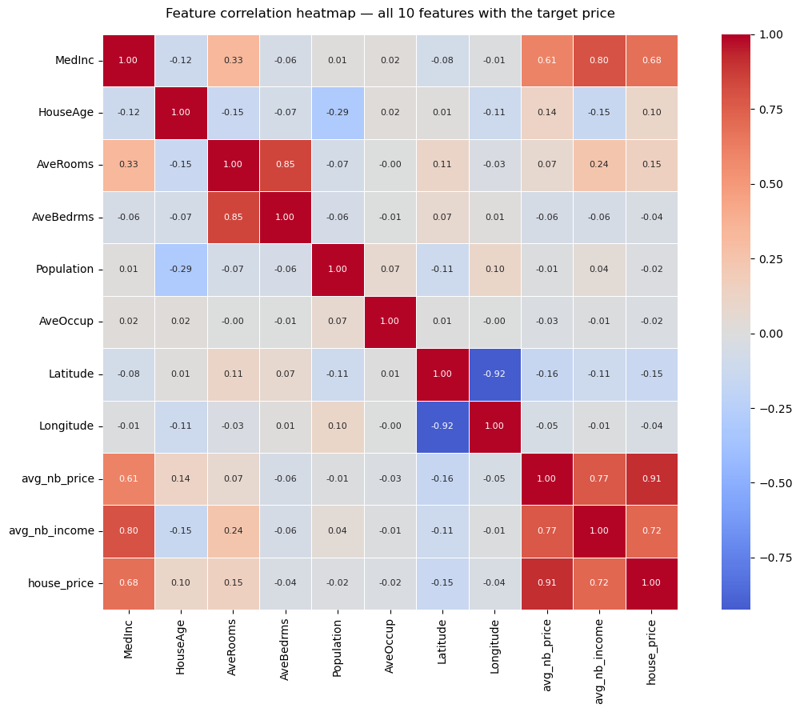
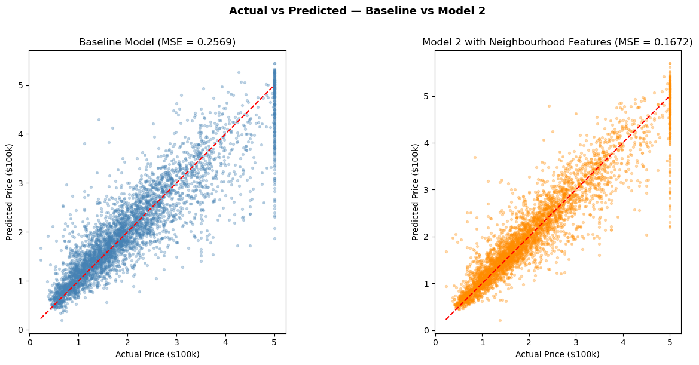

# California House Price Prediction with Neighbourhood Graph Features

A group coursework project for the Graphs, Networks and Systems module. We used feedforward neural networks to predict California housing prices, and showed that engineering new features from spatial neighbourhood relationships can meaningfully improve prediction accuracy.

## Overview

The California Housing dataset (20,640 samples, 8 features) is a well known regression benchmark. Our baseline model uses all eight original features with a multilayer perceptron (MLP). We then extended the feature set by constructing two neighbourhood based features derived from the geographic proximity of housing blocks, treating the dataset as a spatial graph.

The enhanced model reduced test mean squared error by roughly 35%, demonstrating that even a simple graph based approach to feature engineering can capture local patterns that a standard tabular model misses.

## Contributors

- Abraham Sobowale
- Komail Alhelli
- Lucy Cullender
- Shruthi Rajesh Babu
- Temitayo Olowolagba

## Methods

### Data and Preprocessing

We used scikit-learn's `fetch_california_housing` dataset. The data was split 80/20 into training and test sets, and all features were standardised using `StandardScaler` fitted only on the training split to prevent data leakage.

### Baseline Model

A feedforward neural network (`MLPRegressor`) with two hidden layers (64 and 32 neurons), ReLU activation, and the Adam optimiser. This model was trained on the eight original features: median income, house age, average rooms, average bedrooms, population, average occupancy, latitude, and longitude.

### Neighbourhood Feature Engineering

We treated each housing block as a node in a spatial graph, connecting it to its 10 nearest neighbours based on Euclidean distance over latitude and longitude. From this graph we computed two new features for each block:

- **avg_nb_price** — the mean house price of its 10 nearest neighbours
- **avg_nb_income** — the mean median income of its 10 nearest neighbours

These features were computed using training data only, so the test set was never used during construction. The enhanced model was then trained on all 10 features with the same architecture as the baseline.

### Feature Correlations

The heatmap below shows how all 10 features (including the two engineered neighbourhood features) correlate with each other and with the target house price. The neighbourhood features show the strongest correlations with the target, at 0.91 and 0.72 respectively.



## Results

| Model | Features | Test MSE |
|---|---|---|
| Baseline | 8 (original) | 0.2569 |
| Enhanced (Model 2) | 10 (with neighbourhood features) | 0.1672 |

The enhanced model achieved a **34.9% reduction in test MSE** compared to the baseline.

The scatter plots below compare the two models' predictions against actual prices. The enhanced model's predictions cluster much more tightly around the ideal diagonal, particularly in the mid to high price range.



## Repository Structure

```
.
├── README.md
├── requirements.txt
├── docs/
│   └── coursework_brief.pdf          # Original assignment brief
├── images/                            # Figures used in this README
├── notebooks/
│   ├── final/
│   │   └── house_price_prediction.ipynb   # Complete, runnable notebook
│   ├── exploration/
│   │   ├── 01_initial_data_exploration.ipynb
│   │   └── 02_data_understanding_visuals.ipynb
│   └── development/
│       ├── part_1_2_data_loading_and_baseline.ipynb
│       ├── part_3_final_model_training.ipynb
│       ├── part_3_abraham.ipynb
│       ├── part_3_temi.ipynb
│       ├── part_3_temi_v2.ipynb
│       ├── part_4_5_neighbourhood_features.ipynb
│       └── part_4_neighbourhood_feature_engineering.ipynb
└── .gitignore
```

The **final notebook** in `notebooks/final/` contains the complete pipeline from data loading through to evaluation. The **development** folder preserves each team member's individual contributions, and **exploration** holds our early data analysis work.

## Getting Started

### Requirements

- Python 3.10 or later
- The dependencies listed in `requirements.txt`

### Installation

```bash
git clone https://github.com/shrut10/House-Price-Prediction.git
cd House-Price-Prediction
pip install -r requirements.txt
```

### Running the Notebook

Open `notebooks/final/house_price_prediction.ipynb` in Jupyter and run all cells. The dataset is fetched automatically via scikit-learn, so no manual data download is needed.

```bash
jupyter notebook notebooks/final/house_price_prediction.ipynb
```

## Technologies

- Python
- scikit-learn (MLPRegressor, StandardScaler, KNN)
- pandas and NumPy
- matplotlib and seaborn
- Jupyter Notebook

## Licence

This project was completed as university coursework and is shared for educational purposes.
